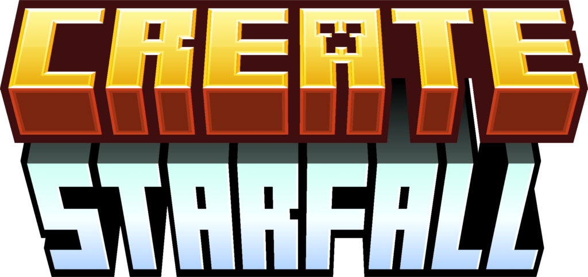

  

# Create: Starfall

A space exploration mod for Minecraft. Built on top of Create Aeronautics.

Build your vessels. Let physics lift your blocks from the dirt into the quiet of the void. Travel. Land. Explore. Procedurally generated worlds drifting in the dark.

Built for Hackclub Stardance. ([Visit the Project ↗](https://stardance.hackclub.com/projects/11911))

Inspired by Outer Wilds and doctor4t.
